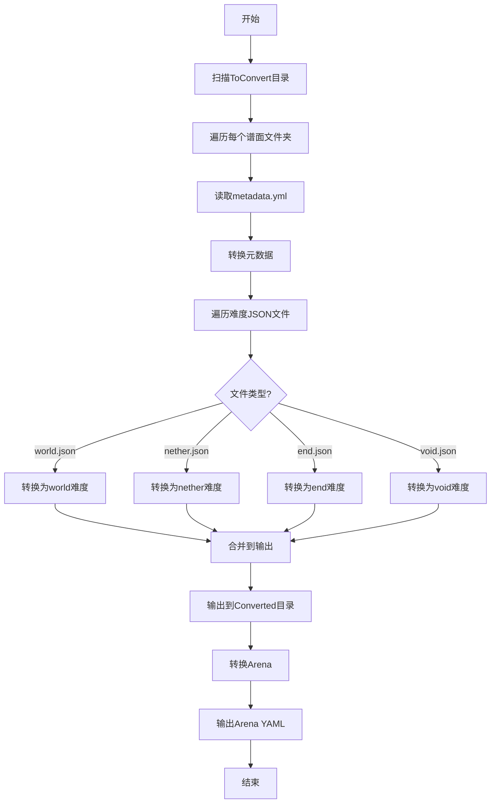

# RhythMC 谱面转换器计划

## 概述

本文档描述了将旧版RhythMC（v1）谱面格式转换为新版RhythMC-Reborn（v2）格式的Java程序设计方案。

## 格式对比

### 旧版格式（v1）

#### metadata.yml
```yaml
name: NULCTRL
respack_sha1: 0e4ffcbb093d13e6de3f8be143e457255b25b154
composer: Silentroom
length: 3040  # 以tick为单位，TPS=20
icon: MUSIC_DISC_5
editor-sha:
  part-1: ...
```

#### 谱面JSON（如nether.json）
```json  
{
  "meta": {
    "charter": "UUID或charter-alias",
    "uuid": "关卡UUID",
    "initial-arena": "Arena名称",
    "flow-speed": 1.0,
    "offset": 0,
    "level": 1.0,
    "comments": [],
    "coop-charters": []
  },
  "frames": [
    {
      "judge-tick": 96,
      "notes": [
        {
          "type": "NOTE_CLICK",
          "pos": [1.0, -0.9]
        }
      ]
    }
  ],
  "effects": [...]
}
```

#### Arena格式
```yaml
arena-displayname: "&3古城"
arena-name: "AncientCity"
price: 1000
can-buy: true
arena-icon: SCULK_CATALYST
schematic-file: "AncientCity.schem"
effects:
  normal-judge-box-material: CYAN_CONCRETE
  reversed-judge-box-material: PURPLE_CONCRETE
```

### 新版格式（v2）

#### metadata.yml
```yaml
name: "test Song"
composer: "test Author"
icon: "NOTE_BLOCK"
alias: "Fuck Me"
length: 2025  # 以毫秒为单位
base_bpm: 100
respack_sha1: "test"
description: "test Description"
song_id: 10001
version: "2.0"
comments:
  - "test Comment"
player-alias:
  - "test"
tags:
  - "test"
unlockSong:
  - type: "regular"
unlockWorld:
  - type: "permission"
    value: "default"
```

#### 谱面JSON
```json
{
  "meta": {
    "charters": ["Frk vs. YKK"],
    "level": 1.0,
    "offset": 3,
    "flow-speed": 1.0,
    "uid": 100012,
    "comments": [],
    "bpms": [{"beat": 0, "bpm": 1200}]
  },
  "tracks": [
    {
      "id": 0,
      "speedEvents": [],
      "xTransformEvents": [],
      "yTransformEvents": [],
      "zTransformEvents": [],
      "xRotateEvents": [],
      "yRotateEvents": [],
      "zRotateEvents": [],
      "xScaleEvents": [],
      "yScaleEvents": [],
      "zScaleEvents": [],
      "notes": [
        {
          "noteType": 0,
          "beat": 0.25,
          "pos": [1.1, 1.1],
          "scale": [1, 1, 1]
        }
      ]
    }
  ],
  "events": [...]
}
```

#### Arena格式
```yaml
name: "AncientCity"
display-name: "&3古城"
author: "Unknown"
description: ""
icon: "SCULK_CATALYST"
border: "CYAN_CONCRETE"
schematic-base64: "base64编码的schematic文件内容"
hide: false
unlock-method:
  type: "money"
  value: 1000.0
```

## 转换规则

### 1. 时间单位转换

- **规则**：TPS = 20，1 tick = 50ms
- **BPM设置**：固定为1200
- **转换公式**：
  - tick → beat: `beat = tick`（因为BPM=1200时，1 beat = 50ms = 1 tick）
  - tick → 毫秒: `ms = tick * 50`
  - length字段：`length_ms = length_tick * 50`

### 2. 音符类型映射

| 旧版类型 | 新版类型 | 类型值 |
|---------|---------|-------|
| NOTE_CLICK | TAP | 0 |
| NOTE_LEFT_CLICK | TAP | 0 |
| NOTE_RIGHT_CLICK | TAP | 0 |
| NOTE_LOOK | LOOK | 1 |
| NOTE_HOLD | HOLD | 2 |
| NOTE_DO_NOT_CLICK | DODGE | 3 |

### 3. 效果类型映射

| 旧版效果 | 新版效果 | 转换说明 |
|---------|---------|---------|
| HOLOGRAM | HOLOGRAM | 直接映射，字段名变化 |
| REMOVEHOLOGRAM | REMOVE_HOLOGRAM | 直接映射 |
| INVERT | EFFECT | 使用BLINDNESS药水效果 |
| MESSAGE | MESSAGE | 直接映射 |
| EFFECT | EFFECT | 直接映射 |
| CLREFFECT | CLEAR_EFFECT | 直接映射 |
| TIME | TIME | 直接映射 |
| WEATHER | WEATHER | 直接映射 |
| COLOR | GLOW_COLOR | 直接映射 |
| ARENA | ARENA | 直接映射 |
| VISIBLE | HIDE_NOTES | 逻辑取反 |
| SPEED | - | 跳过，不转换 |
| JUDGEDOT | - | 跳过，不转换 |
| TEXT | TEXT_DISPLAY | 直接映射 |
| TRANSFORMATIONS | TEXT_DISPLAY_EFFECT | 直接映射 |

### 4. Arena转换

- `name`: 从`arena-name`获取
- `display-name`: 从`arena-displayname`获取
- `author`: 默认值"Unknown"
- `description`: 默认值""
- `icon`: 从`arena-icon`获取
- `border`: 从`effects.normal-judge-box-material`获取，默认"CYAN_CONCRETE"
- `schematic-base64`: 读取schematic文件并Base64编码
- `hide`: 默认false
- `unlock-method`: 根据`can-buy`和`price`生成，格式与metadata.yml中的unlockXxx相同

### 5. 元数据转换

- `song_id`: 递增生成，从10001开始
- `base_bpm`: 固定为1200
- `length`: 从tick转换为毫秒
in- `version`: 设置为"3.0"
- 新增字段使用默认值：
  - `description`: ""
  - `player-alias`: []
  - `tags`: []
  - `unlockSong`: []（留空）
  - `unlockWorld`: []（留空）
  - `unlockNether`: []（留空）
  - `unlockVoid`: []（留空）

## 程序架构

```
src/main/java/cn/frkovo/converter/
├── Main.java                    # 主入口
├── converter/
│   ├── ChartConverter.java      # 谱面转换器
│   ├── ArenaConverter.java      # Arena转换器
│   └── MetadataConverter.java   # 元数据转换器
├── mapper/
│   ├── NoteTypeMapper.java      # 音符类型映射
│   └── EffectTypeMapper.java    # 效果类型映射
├── model/
│   ├── old/                     # 旧版数据模型
│   │   ├── OldChart.java
│   │   ├── OldFrame.java
│   │   ├── OldNote.java
│   │   ├── OldEffect.java
│   │   └── OldArena.java
│   └── new_/                    # 新版数据模型
│       ├── NewChart.java
│       ├── NewTrack.java
│       ├── NewNote.java
│       ├── NewEffect.java
│       └── NewArena.java
└── util/
    ├── TickToBeatConverter.java # 时间转换工具
    └── Base64Encoder.java       # Base64编码工具
```

## 处理流程



## 输出目录结构

```
Converted/
├── Charts/
│   ├── 10001_0e4ffcbb093d13e6de3f8be143e457255b25b154/
│   │   ├── metadata.yml
│   │   ├── world.json
│   │   ├── nether.json
│   │   ├── end.json
│   │   └── void.json
│   └── ...
└── Arenas/
    ├── AncientCity.yml
    ├── Avantgarde.yml
    └── ...
```

## 依赖库

- **Jackson/FastJSON2**: JSON解析和序列化
- **SnakeYAML**: YAML解析和序列化
- **Lombok**: 简化代码

## 待确认事项

- [x] song_id生成策略：递增从10001开始
- [x] 输出目录：Converted/
- [x] Arena缺少字段处理：使用默认值
- [x] 效果类型映射：INVERT→EFFECT(BLINDNESS), VISIBLE→HIDE_NOTES, SPEED跳过
- [x] Schematic文件处理：Base64编码嵌入YAML
- [x] 谱面UnlockMethod：全部留空
- [x] Arena UnlockMethod：根据can-buy和price正常生成
- [x] Version：3.0
- [x] Arena border默认值：CYAN_CONCRETE

## 新版Events格式示例

### 1. HOLOGRAM（全息图）
```json
{
  "eventType": "HOLOGRAM",
  "beat": 10.0,
  "properties": {
    "location": [0.0, 1.5, 0.0],
    "id": "RhyMCGameHologram_1234567890",
    "contents": ["Line 1", "Line 2"],
    "duration": 5000
  }
}
```

### 2. REMOVE_HOLOGRAM（移除全息图）
```json
{
  "eventType": "REMOVE_HOLOGRAM",
  "beat": 20.0,
  "properties": {
    "id": "RhyMCGameHologram_1234567890"
  }
}
```

### 3. EFFECT（药水效果）- 由INVERT转换
```json
{
  "eventType": "EFFECT",
  "beat": 15.0,
  "properties": {
    "effectId": 15,
    "amplifier": 1,
    "duration": 5000
  }
}
```
注：effectId 15 = BLINDNESS（致盲效果）

### 4. CLEAR_EFFECT（清除药水效果）
```json
{
  "eventType": "CLEAR_EFFECT",
  "beat": 25.0,
  "properties": {}
}
```

### 5. TIME（时间设置）
```json
{
  "eventType": "TIME",
  "beat": 5.0,
  "properties": {
    "time": 18000,
    "duration": 5000
  }
}
```

### 6. WEATHER（天气设置）
```json
{
  "eventType": "WEATHER",
  "beat": 8.0,
  "properties": {
    "weather": "DOWNFALL"
  }
}
```

### 7. GLOW_COLOR（音符发光颜色）- 由COLOR转换
```json
{
  "eventType": "GLOW_COLOR",
  "beat": 12.0,
  "properties": {
    "color": "RED"
  }
}
```

### 8. ARENA（切换场景）
```json
{
  "eventType": "ARENA",
  "beat": 30.0,
  "properties": {
    "arena": "AncientCity"
  }
}
```

### 9. MESSAGE（消息）
```json
{
  "eventType": "MESSAGE",
  "beat": 35.0,
  "properties": {
    "contents": ["First message", "Second message"]
  }
}
```

### 10. HIDE_NOTES（隐藏音符）- 由VISIBLE转换
```json
{
  "eventType": "HIDE_NOTES",
  "beat": 40.0,
  "properties": {
    "noteTypes": ["TAP", "HOLD"],
    "tracks": [1, 2]
  }
}
```
注：旧版VISIBLE=false时，新版HIDE_NOTES显示音符；旧版VISIBLE=true时，新版HIDE_NOTES隐藏指定类型音符

### 11. TITLE（标题）
```json
{
  "eventType": "TITLE",
  "beat": 45.0,
  "properties": {
    "title": "Main Title",
    "subtitle": "Subtitle text",
    "fadeIn": 10,
    "stay": 70,
    "fadeOut": 20
  }
}
```

### 12. TEXT_DISPLAY（文本显示）- 由TEXT转换
```json
{
  "eventType": "TEXT_DISPLAY",
  "beat": 50.0,
  "properties": {
    "id": "display_id",
    "text": "Display Text",
    "position": [0.0, 1.5, 0.0],
    "rotation": [0.0, 0.0, 0.0],
    "scale": [1.0, 1.0, 1.0]
  }
}
```

### 13. TEXT_DISPLAY_EFFECT（文本显示效果）- 由TRANSFORMATIONS转换
```json
{
  "eventType": "TEXT_DISPLAY_EFFECT",
  "beat": 55.0,
  "properties": {
    "id": "display_id",
    "type": "TRANSFORMATION",
    "to": [1.0, 2.0, 3.0],
    "rotate": 45.0,
    "scale": 1.5
  }
}
```

### 14. TEXT_DISPLAY_REMOVE（移除文本显示）
```json
{
  "eventType": "TEXT_DISPLAY_REMOVE",
  "beat": 60.0,
  "properties": {
    "id": "display_id"
  }
}
```

### 15. FIREWORK（烟花）
```json
{
  "eventType": "FIREWORK",
  "beat": 65.0,
  "properties": {
    "location": [0.0, 2.0, 0.0],
    "power": 1,
    "effects": [...]
  }
}
```

## 效果类型详细转换示例

本节展示每种效果类型在旧版和新版格式中的具体示例。

### 1. ARENA（切换场景）

**旧版格式：**
```json
{
  "effect-type": "ARENA",
  "start-tick": 0,
  "arena": "snow1"
}
```

**新版格式：**
```json
{
  "eventType": "ARENA",
  "beat": 0.0,
  "properties": {
    "arena": "snow1"
  }
}
```

**字段映射：**
| 旧版字段 | 新版字段 | 说明 |
|---------|---------|------|
| effect-type | eventType | 固定值"ARENA" |
| start-tick | beat | tick直接作为beat（BPM=1200） |
| arena | properties.arena | 场景名称 |

---

### 2. TIME（时间设置）

**旧版格式：**
```json
{
  "effect-type": "TIME",
  "start-tick": 0,
  "time": 100
}
```

**新版格式：**
```json
{
  "eventType": "TIME",
  "beat": 0.0,
  "properties": {
    "time": 100
  }
}
```

**字段映射：**
| 旧版字段 | 新版字段 | 说明 |
|---------|---------|------|
| effect-type | eventType | 固定值"TIME" |
| start-tick | beat | tick直接作为beat |
| time | properties.time | 游戏内时间（0-24000） |

---

### 3. JUDGEDOT（判定点）- 跳过不转换

**旧版格式：**
```json
{
  "effect-type": "JUDGEDOT",
  "start-tick": 0,
  "dot": 0.01
}
```

**处理方式：** 跳过，不转换到新版

---

### 4. EFFECT（药水效果）

**旧版格式：**
```json
{
  "effect-type": "EFFECT",
  "start-tick": 965,
  "amplifier": 19,
  "effect-id": "BLINDNESS",
  "duration": 600
}
```

**新版格式：**
```json
{
  "eventType": "EFFECT",
  "beat": 965.0,
  "properties": {
    "effectId": 15,
    "amplifier": 19,
    "duration": 600
  }
}
```

**字段映射：**
| 旧版字段 | 新版字段 | 说明 |
|---------|---------|------|
| effect-type | eventType | 固定值"EFFECT" |
| start-tick | beat | tick直接作为beat |
| effect-id | properties.effectId | 药水效果名称转ID（BLINDNESS=15, SPEED=1, DARKNESS=13等） |
| amplifier | properties.amplifier | 效果强度 |
| duration | properties.duration | 持续时间（tick） |

**药水效果ID对照表：**
| 效果名称 | ID |
|---------|-----|
| BLINDNESS | 15 |
| SPEED | 1 |
| SLOW | 2 |
| DARKNESS | 13 |
| JUMP | 8 |

---

### 5. CLREFFECT（清除药水效果）

**旧版格式：**
```json
{
  "effect-type": "CLREFFECT",
  "start-tick": 1051
}
```
或带效果ID：
```json
{
  "effect-type": "CLREFFECT",
  "start-tick": 2536,
  "effect-id": "BLINDNESS"
}
```

**新版格式：**
```json
{
  "eventType": "CLEAR_EFFECT",
  "beat": 1051.0,
  "properties": {}
}
```

**字段映射：**
| 旧版字段 | 新版字段 | 说明 |
|---------|---------|------|
| effect-type | eventType | 固定值"CLEAR_EFFECT" |
| start-tick | beat | tick直接作为beat |
| effect-id | - | 新版不支持指定效果ID，清除所有效果 |

---

### 6. TEXT（文本显示）

**旧版格式：**
```json
{
  "effect-type": "TEXT",
  "start-tick": 1250,
  "id": "0",
  "loc": [-0.45, 2.75, 0.0],
  "content": "CURRENT STYLE : "
}
```

**新版格式：**
```json
{
  "eventType": "TEXT_DISPLAY",
  "beat": 1250.0,
  "properties": {
    "id": "0",
    "text": "CURRENT STYLE : ",
    "position": [-0.45, 2.75, 0.0],
    "rotation": [0.0, 0.0, 0.0],
    "scale": [1.0, 1.0, 1.0]
  }
}
```

**字段映射：**
| 旧版字段 | 新版字段 | 说明 |
|---------|---------|------|
| effect-type | eventType | 固定值"TEXT_DISPLAY" |
| start-tick | beat | tick直接作为beat |
| id | properties.id | 文本显示ID |
| loc | properties.position | 位置坐标 [x, y, z] |
| content | properties.text | 文本内容 |
| - | properties.rotation | 默认值 [0.0, 0.0, 0.0] |
| - | properties.scale | 默认值 [1.0, 1.0, 1.0] |

---

### 7. TRANSFORMATIONS（文本显示效果）

TRANSFORMATIONS有多种子类型，根据`type`字段区分：

#### 7.1 REMOVE（移除文本显示）

**旧版格式：**
```json
{
  "effect-type": "TRANSFORMATIONS",
  "start-tick": 2014,
  "id": "1",
  "duration": 0,
  "type": "REMOVE"
}
```

**新版格式：**
```json
{
  "eventType": "TEXT_DISPLAY_REMOVE",
  "beat": 2014.0,
  "properties": {
    "id": "1"
  }
}
```

#### 7.2 TRANSFORMATION（变换）

**旧版格式：**
```json
{
  "effect-type": "TRANSFORMATIONS",
  "start-tick": 100,
  "id": "display1",
  "duration": 10,
  "type": "TRANSFORMATION",
  "to": [1.0, 2.0, 3.0],
  "rotate": 45.0,
  "scale": 1.5
}
```

**新版格式：**
```json
{
  "eventType": "TEXT_DISPLAY_EFFECT",
  "beat": 100.0,
  "properties": {
    "id": "display1",
    "type": "TRANSFORMATION",
    "to": [1.0, 2.0, 3.0],
    "rotate": 45.0,
    "scale": 1.5,
    "duration": 10
  }
}
```

#### 7.3 OPACITY（透明度）

**旧版格式：**
```json
{
  "effect-type": "TRANSFORMATIONS",
  "start-tick": 200,
  "id": "display1",
  "duration": 5,
  "type": "OPACITY",
  "to": -128
}
```

**新版格式：**
```json
{
  "eventType": "TEXT_DISPLAY_EFFECT",
  "beat": 200.0,
  "properties": {
    "id": "display1",
    "type": "OPACITY",
    "to": -128,
    "duration": 5
  }
}
```

#### 7.4 BACKGROUND_COLOR（背景颜色）

**旧版格式：**
```json
{
  "effect-type": "TRANSFORMATIONS",
  "start-tick": 1,
  "id": "jz1",
  "duration": 0,
  "type": "BACKGROUND_COLOR",
  "color": [0, 0, 0, 0]
}
```

**新版格式：**
```json
{
  "eventType": "TEXT_DISPLAY_EFFECT",
  "beat": 1.0,
  "properties": {
    "id": "jz1",
    "type": "BACKGROUND_COLOR",
    "color": [0, 0, 0, 0],
    "duration": 0
  }
}
```

**注意：** `color`字段在TRANSFORMATIONS中是数组格式[ARGB]，与COLOR效果中的字符串格式不同！

#### 7.5 SHADOW（阴影）

**旧版格式：**
```json
{
  "effect-type": "TRANSFORMATIONS",
  "start-tick": 300,
  "id": "display1",
  "duration": 0,
  "type": "SHADOW",
  "shadow": true
}
```

**新版格式：**
```json
{
  "eventType": "TEXT_DISPLAY_EFFECT",
  "beat": 300.0,
  "properties": {
    "id": "display1",
    "type": "SHADOW",
    "shadow": true,
    "duration": 0
  }
}
```

#### 7.6 GLOWING（发光）

**旧版格式：**
```json
{
  "effect-type": "TRANSFORMATIONS",
  "start-tick": 400,
  "id": "display1",
  "duration": 0,
  "type": "GLOWING",
  "glowing": true
}
```

**新版格式：**
```json
{
  "eventType": "TEXT_DISPLAY_EFFECT",
  "beat": 400.0,
  "properties": {
    "id": "display1",
    "type": "GLOWING",
    "glowing": true,
    "duration": 0
  }
}
```

#### 7.7 TEXT（文本内容更新）

**旧版格式：**
```json
{
  "effect-type": "TRANSFORMATIONS",
  "start-tick": 500,
  "id": "display1",
  "duration": 0,
  "type": "TEXT",
  "content": "New Text Content"
}
```

**新版格式：**
```json
{
  "eventType": "TEXT_DISPLAY_EFFECT",
  "beat": 500.0,
  "properties": {
    "id": "display1",
    "type": "TEXT",
    "content": "New Text Content",
    "duration": 0
  }
}
```

**TRANSFORMATIONS字段映射总表：**
| 旧版字段 | 新版字段 | 说明 |
|---------|---------|------|
| effect-type | eventType | REMOVE→TEXT_DISPLAY_REMOVE，其他→TEXT_DISPLAY_EFFECT |
| start-tick | beat | tick直接作为beat |
| id | properties.id | 文本显示ID |
| type | properties.type | 子类型（TRANSFORMATION/OPACITY/BACKGROUND_COLOR/SHADOW/GLOWING/TEXT/REMOVE） |
| duration | properties.duration | 过渡持续时间 |
| to | properties.to | 目标值（位置或透明度） |
| rotate | properties.rotate | 旋转角度 |
| scale | properties.scale | 缩放比例 |
| color | properties.color | ARGB颜色数组（仅BACKGROUND_COLOR） |
| shadow | properties.shadow | 是否显示阴影（仅SHADOW） |
| glowing | properties.glowing | 是否发光（仅GLOWING） |
| content | properties.content | 文本内容（仅TEXT） |

---

### 8. COLOR（音符发光颜色）

**旧版格式：**
```json
{
  "effect-type": "COLOR",
  "start-tick": 6178,
  "color": "YELLOW"
}
```

**新版格式：**
```json
{
  "eventType": "GLOW_COLOR",
  "beat": 6178.0,
  "properties": {
    "color": "YELLOW"
  }
}
```

**字段映射：**
| 旧版字段 | 新版字段 | 说明 |
|---------|---------|------|
| effect-type | eventType | 固定值"GLOW_COLOR" |
| start-tick | beat | tick直接作为beat |
| color | properties.color | 颜色名称字符串（如BLACK, WHITE, YELLOW等） |

**注意：** COLOR效果中的`color`字段是字符串格式，与TRANSFORMATIONS中的数组格式不同！

---

### 9. INVERT（反转）→ EFFECT

**旧版格式：**
```json
{
  "effect-type": "INVERT",
  "start-tick": 1,
  "duration": 479
}
```

**新版格式：**
```json
{
  "eventType": "EFFECT",
  "beat": 1.0,
  "properties": {
    "effectId": 15,
    "amplifier": 1,
    "duration": 479
  }
}
```

**字段映射：**
| 旧版字段 | 新版字段 | 说明 |
|---------|---------|------|
| effect-type | eventType | 固定值"EFFECT" |
| start-tick | beat | tick直接作为beat |
| duration | properties.duration | 持续时间（tick） |
| - | properties.effectId | 固定值15（BLINDNESS） |
| - | properties.amplifier | 固定值1 |

---

### 10. HOLOGRAM（全息图）

**旧版格式：**
```json
{
  "effect-type": "HOLOGRAM",
  "start-tick": 19,
  "duration": 1,
  "hologram-loc": [0.0, 1.0, 0.0],
  "hologram-contents": ["&k0"]
}
```

**新版格式：**
```json
{
  "eventType": "HOLOGRAM",
  "beat": 19.0,
  "properties": {
    "location": [0.0, 1.0, 0.0],
    "id": "RhyMCGameHologram_<auto_generated>",
    "contents": ["&k0"],
    "duration": 1
  }
}
```

**字段映射：**
| 旧版字段 | 新版字段 | 说明 |
|---------|---------|------|
| effect-type | eventType | 固定值"HOLOGRAM" |
| start-tick | beat | tick直接作为beat |
| hologram-loc | properties.location | 位置坐标 |
| hologram-contents | properties.contents | 文本内容数组 |
| duration | properties.duration | 持续时间 |
| - | properties.id | 自动生成唯一ID |

---

### 11. MESSAGE（消息）

**旧版格式：**
```json
{
  "effect-type": "MESSAGE",
  "start-tick": 97,
  "contents": ["&b&k000"]
}
```

**新版格式：**
```json
{
  "eventType": "MESSAGE",
  "beat": 97.0,
  "properties": {
    "contents": ["&b&k000"]
  }
}
```

**字段映射：**
| 旧版字段 | 新版字段 | 说明 |
|---------|---------|------|
| effect-type | eventType | 固定值"MESSAGE" |
| start-tick | beat | tick直接作为beat |
| contents | properties.contents | 消息内容数组 |

---

### 12. VISIBLE（音符可见性）→ HIDE_NOTES

**旧版格式：**
```json
{
  "effect-type": "VISIBLE",
  "start-tick": 1,
  "duration": 100
}
```

**新版格式：**
```json
{
  "eventType": "HIDE_NOTES",
  "beat": 1.0,
  "properties": {
    "noteTypes": ["TAP", "HOLD"],
    "tracks": [],
    "duration": 100
  }
}
```

**字段映射：**
| 旧版字段 | 新版字段 | 说明 |
|---------|---------|------|
| effect-type | eventType | 固定值"HIDE_NOTES" |
| start-tick | beat | tick直接作为beat |
| duration | properties.duration | 持续时间 |
| - | properties.noteTypes | 默认隐藏TAP和HOLD |
| - | properties.tracks | 默认空数组（所有轨道） |

**逻辑说明：** 旧版VISIBLE效果用于控制音符可见性，新版使用HIDE_NOTES实现类似功能。

---

### 13. SPEED（速度效果）- 跳过不转换

**旧版格式：**
```json
{
  "effect-type": "EFFECT",
  "start-tick": 2015,
  "amplifier": 19,
  "effect-id": "SPEED",
  "duration": 27
}
```

**处理方式：** 当effect-id为SPEED时，跳过不转换

---

## 特殊处理说明

### color字段的多态性

在旧版格式中，`color`字段有两种不同的格式：

1. **COLOR效果中**：字符串格式
   ```json
   {
     "effect-type": "COLOR",
     "color": "BLACK"
   }
   ```

2. **TRANSFORMATIONS/BACKGROUND_COLOR中**：数组格式
   ```json
   {
     "effect-type": "TRANSFORMATIONS",
     "type": "BACKGROUND_COLOR",
     "color": [0, 0, 0, 0]
   }
   ```

**转换器处理逻辑：**
- 解析时需要根据`effect-type`判断`color`字段的类型
- COLOR效果：`color`为字符串，直接映射到`properties.color`
- TRANSFORMATIONS效果：`color`为JSONArray[ARGB]，直接映射到`properties.color`

### TRANSFORMATIONS子类型处理

TRANSFORMATIONS效果根据`type`字段分为多种子类型：

| type值 | 新版eventType | 说明 |
|--------|--------------|------|
| REMOVE | TEXT_DISPLAY_REMOVE | 移除文本显示 |
| TRANSFORMATION | TEXT_DISPLAY_EFFECT | 变换位置/旋转/缩放 |
| OPACITY | TEXT_DISPLAY_EFFECT | 改变透明度 |
| BACKGROUND_COLOR | TEXT_DISPLAY_EFFECT | 改变背景颜色 |
| SHADOW | TEXT_DISPLAY_EFFECT | 设置阴影 |
| GLOWING | TEXT_DISPLAY_EFFECT | 设置发光 |
| TEXT | TEXT_DISPLAY_EFFECT | 更新文本内容 |

### 药水效果ID映射表

| 效果名称 | ID | 说明 |
|---------|-----|------|
| SPEED | 1 | 速度（跳过不转换） |
| SLOW | 2 | 缓慢 |
| JUMP | 8 | 跳跃提升 |
| DARKNESS | 13 | 黑暗 |
| BLINDNESS | 15 | 失明 |
| INVERT转换 | 15 | 固定使用BLINDNESS |
